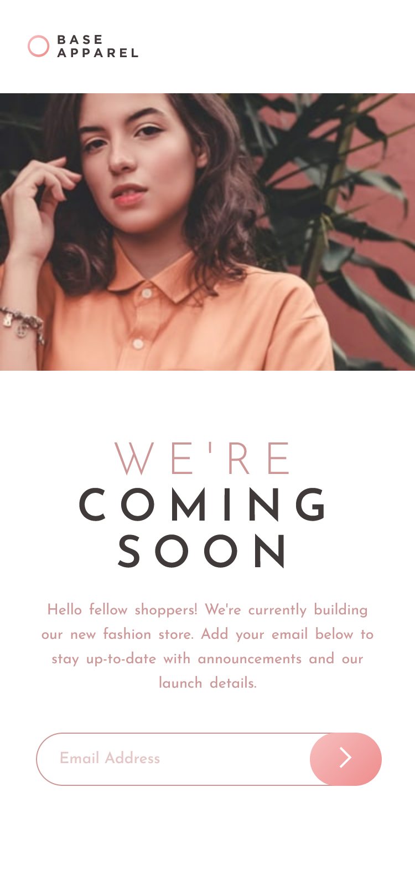

## Welcome! 👋🏼

# Frontend Mentor - Base Apparel Coming Soon Page

[Frontend Mentor](https://www.frontendmentor.io) challenges help you improve your coding skills by building realistic projects

## Table of contents    

- [Overview](#overview)
  - [The challenge](#the-challenge)
  - [My Achievements](#my-achievements)
  - [Screenshot](#screenshot)
  - [Links](#links)
- [My process](#my-process)
  - [Built with](#built-with)
- [Author](#author)

## Overview

[This is an entry-level NEWBIE(Free) challenge that uses HTML, CSS & JS](https://www.frontendmentor.io/challenges/base-apparel-coming-soon-page-5d46b47f8db8a7063f9331a0)

## The challenge

- View the optimal layout for the site depending on their device's screen size
- See hover states for all interactive elements on the page
- Receive an error message when the form is submitted if:
    - The email input field is empty
    - The email address is not formatted correctly

## My Achievements

- built the component almost close to the design provided.
- set hover states for interactive elements using Javascript
- customized & added some error handlings for elements using Javascript
    - customized default error msg to be dynamic
    - added character validations

### Screenshot

- mobile-version 

 
- desktop-version  

### Links

<<<<<<< HEAD
- Solution URL: [Frontend Mentor Solution Page](https://www.frontendmentor.io/solutions/a-simple-coming-soon-page-for-an-apparel-company-website-b2H9pOxuAk)
=======
- Solution URL: [Frontend Mentor Solution Page] (https://www.frontendmentor.io/solutions/a-simple-coming-soon-page-for-an-apparel-company-website-b2H9pOxuAk)
>>>>>>> 67695c6e120ee40b3e9a56960e8761de5d0da9e7
- Live Site URL: [GitHub Pages](https://m-lakshan.github.io/FM_Challenge-Base-Apparel-Coming-Soon-Page/)

## My process

### Built with

- Semantic HTML5 markup
- CSS custom properties
- CSS Flexbox & Grid
- Mobile-first workflow
- custom interactions & validations using JS
- with Visual Studio Code Editor

## Author

- Frontend Mentor - [@M-lakshan](https://www.frontendmentor.io/profile/M-lakshan)
- Dev.to - [@mlakshan](https://dev.to/mlakshan)
